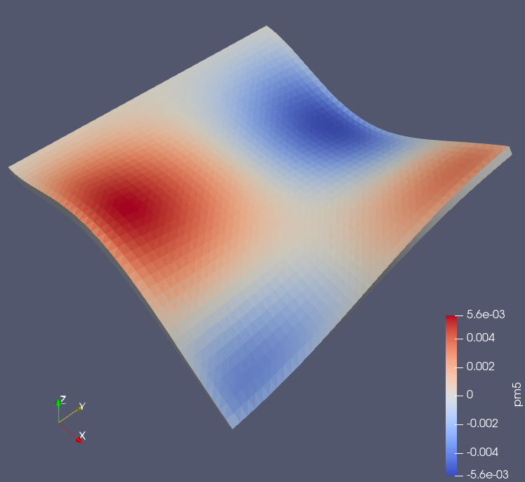

[](http://www.repostatus.org/#active)
[](https://travis-ci.com/PetrKryslUCSD/FinEtoolsVibInFluids.jl)
[](https://petrkryslucsd.github.io/FinEtoolsVibInFluids.jl/dev)

# FinEtoolsVibInFluids: Vibration of elastic objects in fluids

[`FinEtools`](https://github.com/PetrKryslUCSD/FinEtools.jl.git) is a package
for basic operations on finite element meshes. `FinEtoolsVibInFluids` is a package
using `FinEtools` to solve problems of free vibration in fluids.

Fu, Price clamped plate, vibration mode 5, pressure field on the surface.

## News

- 01/07/2023: Updated for FinEtools 7.3.0.

[Past news](oldnews.md)

## How to test the package

Here is a record of a session to install this package and test it. You should
see something similar. The git bash running on Windows 10 was used in this
example.

Clone the repo:
```
PetrKrysl@Spectre MINGW64 /tmp/exp
$ git clone https://github.com/PetrKryslUCSD/FinEtoolsVibInFluids.jl.git
Cloning into 'FinEtoolsVibInFluids.jl'...
...
```
Change your working directory, and run Julia:
```
$ cd FinEtoolsVibInFluids.jl/

PetrKrysl@Spectre MINGW64 /tmp/exp/FinEtoolsVibInFluids.jl (master)
$ ~/AppData/Local/Programs/Julia/Julia-1.5.0-DEV/bin/julia.exe
```
Activate and instantiate the environment:
```
julia> using Pkg; Pkg.activate("."); Pkg.instantiate()   
Activating environment at `C:\Users\PKrysl\Documents\work\FinEtoolsVibInFluids\Project.toml`     
```
Test the package:
```
(FinEtoolsVibInFluids) pkg> test
Test Summary:       | Pass  Total     
Vibration in fluids |    1      1     
 43.373997 seconds (66.45 M allocations: 3.625 GiB, 5.14% gc time)    
   Testing FinEtoolsVibInFluids tests passed    
```

## Examples

Activate and instantiate the environment:
```
using Pkg
Pkg.activate("."); Pkg.instantiate()
```

There are a number of examples, which may
be executed as described in the  [conceptual guide to
`FinEtools`](https://petrkryslucsd.github.io/FinEtools.jl/latest).
